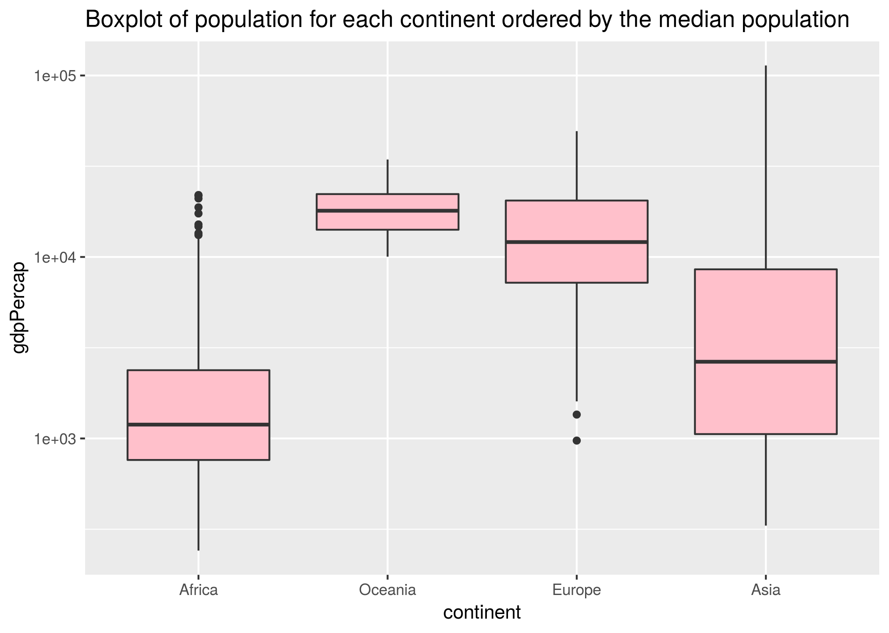
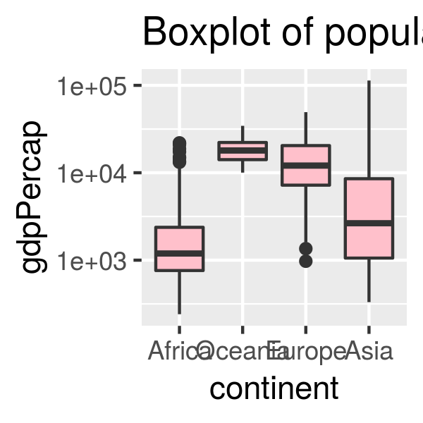
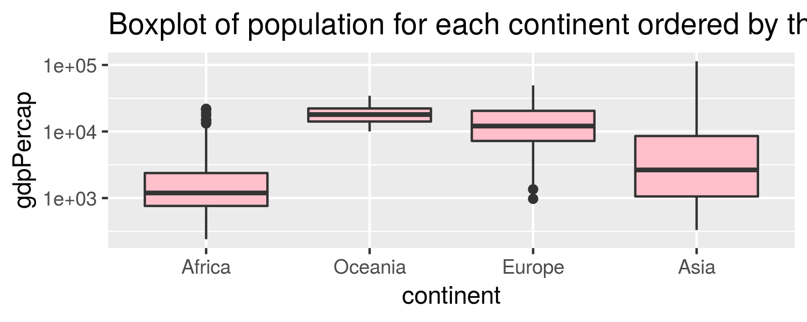

Factor and figure management
===


[Please click here for a .html version of the assignment](https://iyaniwura.github.io/hw5/homework5.html)

**(It may be slow in loading due to the size of the document)**


# Loading libraries
  
 Let us  load the necessary library required for this homework.
  
  
```{r}
suppressPackageStartupMessages(library(tidyverse))
suppressPackageStartupMessages(library(gapminder))
suppressPackageStartupMessages(library(gridExtra))
```


# Part 1: Factor management

  We shall be using the `gapminder` data set for this exercise.
  
## Drop Oceania: 

  We begin  by removing the rows for the continent Oceania from the `gapminder` data set. Before we do this, let us use the `str()` function to check the number of factors in the gapminder data set and the number of level each factor has.

```{r}
gapminder %>% #loads the gapminder data set and pipes it into the function in the next line
  str() 
```
  
  This ouput shows that the `gapminder` data set has two factors; country and continent. Country has 142 levels, while continent has 5 levels. Also we see that this data set has 1704 rows and 6 columns. We can visualized this data using a barchart as shown below;
  
```{r}
gapminder %>%  # loads the gapminder data and pipes it into the next line
  ggplot(aes(continent)) + geom_bar() + # use ggplot to produce a barhcart
  ggtitle("The number of observations for each continent")
```  
  
Let us arrange this data according to the population in ascending and plot a barchart of the new data set. We want to see if the `arrange()` function has an effect on the plot.

```{r}
ArrGap <- gapminder %>%  # loads the gapminder data and pipes it into the next line
            arrange(pop) # arranges the data according to the population in ascending order
 
# display few rows of data
ArrGap %>%  # loads the ArrGap data and pipes it into the next line
  head() %>%
  knitr::kable()
  
# plotting the data
 ArrGap %>% 
  ggplot(aes(continent)) + geom_bar() + # use ggplot to produce a barhcart 
  ggtitle("The number of observations for each continent")
```

Observe from the table and figures above that the `arrange()` function re-arranges the rows of the data but this re-arrangement does not affect the figure produced after arranging the  data.

Now, let us extract out data from the gapminder data set.
  
```{r}
# create a subset of gapminder data that does not contain Oceania, call this data set 'GapNoOcean'
GapNoOcean <- gapminder %>% #loads the data set and pipes it into the function in the next line
        filter(continent != "Oceania")


# displaying table nicely
head(GapNoOcean,15) %>%
  knitr::kable()
```

Let us use the `str()` function to check the factors and their levels of our new data set.

```{r}
GapNoOcean %>% #loads the data set and pipes it into the function in the next line
  str() 
```

After removing the rows for the countries in Oceania from the gapminder data set, the new data set has 1680 rows, although, the number of factors in the new data frame still remains 5. Let us check the levels in the continent factor again using the `level()` function.

```{r}
levels(GapNoOcean$continent)  # displays the number of levelsof the continent factor
```

This also shows that there are 5 level, it shows both the used and unused levels.

```{r}
GapNoOcean %>% #loads the data set and pipes it into the function in the next line
  ggplot(aes(continent)) + geom_bar() +  # plots a barchart of the data
  scale_x_discrete(drop=FALSE) + ggtitle("The number of observations for each continent")
```  

This plot shows that the continent Oceania is still a level in the data, althogh it has no entries. Let us arrange this new data set according to the number of observations in ascending order.


```{r}
GapNoOcean %>%  #loads the data set and pipes it into the function in the next line
  arrange(pop) %>%  # arranges the data according to the population size in ascending order
  ggplot(aes(continent)) + geom_bar()  + # plots barchart
  ggtitle("The number of observations for each continent")
```

After arranging re-arranging the data, the Oceania continent is dropped from the barchart.


Let us remove unused levels in the continent.

```{r}
GapNoOceanD <- GapNoOcean %>%
                droplevels() # drops the unused levels

str(GapNoOceanD) # displays the structure of the data
levels(GapNoOceanD$continent) # shows the levels in the continent factor
```

It now shows that the continent factor has only 4 levels.

There are other ways we can drop unused levels, let us check them out!

```{r}
forcats::fct_drop(GapNoOcean$continent) %>% # drops unused levels
  levels() # shows the levels in the continent factor


fct_drop(GapNoOcean$continent) %>%  # drops unused levels
  levels()  # shows the levels in the continent factor
```

## Reorder the levels of the country or continent
  
  Let us start by plotting a barchart of the `GapNoOceanD` data.
  
```{r}
GapNoOceanD %>%  # loads the data set and pipes it into the next line
  ggplot(aes(continent)) + geom_bar() +  # plots the barchart
  scale_x_discrete(drop=FALSE)  + ggtitle("The number of observations for each continent")
```  

The continent factor can be reordered in descending order of freqency on the barchart;

```{r}
GapNoOceanD$continent %>% # loads the data set and pipes it into the next line
  fct_infreq() %>% # reorders level in descending order of frequency
   qplot()  + ggtitle("The number of observations for each continent in descending order") # plots barchart
```

This ordering is reversed using the `forcats::fct_rev()` function.

```{r}
GapNoOceanD$continent %>% # loads the data set and pipes it into the next line
  forcats::fct_infreq() %>%  # reorders level in descending order of frequency
  forcats::fct_rev() %>%  # reverses the previous order
   qplot()  + ggtitle("The number of observations for each continent after reversing level")
```

Let us present a boxplot of the reordering of continents based on some principled summary of `pop`.

```{r}
GapNoOceanD %>%
  ggplot( aes(continent,pop)) +   geom_boxplot() +
  scale_y_log10()  + ggtitle("Boxplot of population for each continent ordered by the median population")


GapNoOceanD %>%  
  group_by(continent) %>%
  mutate(median = median((pop))) %>%
  arrange(median) %>%
  ggplot( aes(continent,pop)) +   geom_boxplot(fill='pink') +
  scale_y_log10()  + ggtitle("Boxplot of population for each continent ordered by the median population")


GapNoOceanD %>%
  mutate(continent= fct_reorder(continent,pop)) %>%
  ggplot( aes(continent,pop)) +   geom_boxplot(fill='pink') +
  scale_y_log10()  + ggtitle("Boxplot of population for each continent ordered by the median population")

```


  * Reorder by median population of each continent

  
```{r}
GapNoOceanD %>% # loads data and pipes it to the next line
  mutate(continent= fct_reorder(continent,pop)) %>%   # reorders the data
  ggplot( aes(continent,pop)) +   geom_boxplot() + # plots a boxplot
  scale_y_log10()  + ggtitle("Population of each continent reordered by median population")

```

  * Reorder by mean population of each continent


```{r}
GapNoOceanD %>% # loads data and pipes it to the next line
  mutate(continent= fct_reorder(continent,pop, mean)) %>%  # reorders the data
  ggplot( aes(continent, pop)) +   geom_boxplot() +  # plots a boxplot
  scale_y_log10()  + ggtitle("Population of each continent reordered by mean population")

```

   * Reorder by maximum population of each continent


```{r}
GapNoOceanD %>% # loads data and pipes it to the next line
  mutate(continent= fct_reorder(continent,pop, max)) %>%  # reorders the data
  ggplot( aes(continent, pop)) +   geom_boxplot() +  # plots a boxplot
  scale_y_log10()  + ggtitle("Population of each continent reordered by maximum population")
 
```

  * Reorder by minimum population of each continent


```{r}
GapNoOceanD %>% # loads data and pipes it to the next line
  mutate(continent= fct_reorder(continent,pop, min )) %>%   # reorders the data
  ggplot( aes(continent,pop)) +   geom_boxplot() +  # plots a boxplot
  scale_y_log10() + ggtitle("Population of each continent reordered by minimum population")
```


# Part 2: File I/O

## Reading and writing data set into a file

First, let us extract the data set to be used for this exercise from the `gapminder` data set.

```{r}
NewGap <- gapminder %>%  # loads data and pipes it to the next line
            filter(continent == "Europe"|continent == "Asia"|continent == "Africa"|continent == "Oceania") %>%
            arrange(gdpPercap) 

str(NewGap) # displays structure of new data set

# display few rows of new data set
NewGap %>% # loads data and pipes it to the next line
    head() %>%
    knitr::kable()
```

Let us create a boxplot of the extracted data and name it `Default`.

```{r}
Default <-NewGap %>% # loads data and pipes it to the next line
            ggplot( aes(continent,gdpPercap)) +   geom_boxplot(fill='green') + # plots a boxplot
            scale_y_log10()  + ggtitle("Without factor re-order") # scales the y-axis and put title on the graph

Default
```

Now, we reorder the factor levels and create another boxplot.

```{r, fig.width=8, fig.height=5}
NewGapReorder <-NewGap %>%  # loads data and pipes it to the next line
  mutate(continent= fct_reorder(continent,gdpPercap,max))   # reorders the level of the continent using the max population

P <- NewGapReorder %>%  # loads data and pipes it to the next line
  ggplot( aes(continent,gdpPercap)) +   geom_boxplot(fill='pink') + # produces a boxplot
  scale_y_log10()  + ggtitle("Re-ordering factor by max. GdpPercap")

# put the two boxplots side-by-side
grid.arrange(Default,P,ncol=2,top="Comparing the Boxplot of GdpPerCap for the continents with and without factor re-order")

```

Next, we display the ordering of the levels of continent.

```{r}
levels(NewGapReorder$continent)  # displays the levels of the selected factor the way the are ordered
```

Let us create another plot of the reorder data and assign it to the variable `PP`. This plot will be places side-by-side to the new plot generated from the data read from files in order to determine which of the writing and reading format preserves ordering.

```{r} 
GapOrdered <-NewGapReorder %>%  # loads data and pipes it to the next line
  mutate(continent= fct_reorder(continent,gdpPercap,max)) %>%  # reorder continent by max population
  ggplot( aes(continent,gdpPercap)) +   geom_boxplot(fill='pink') +  # produces boxplot
  scale_y_log10()  + ggtitle("Data written to file")

```

### `read_csv()` and `write_csv()`

Writing the reordered data to file.

```{r}
write_csv(NewGapReorder,"NewGap") # writes the gapminder data set into a file called 'MyGapMinder', in .csv format
```

Reading back from file.

```{r}
# reading data from file
GapCSV <- read_csv("NewGap")  # reads the gapminder file in csv format

# displays the structure
GapCSV %>%
  str()

# display in table
GapCSV %>%
  head() %>%
  knitr::kable()

```

Observe that the structure is not the same as the data written to file, the factors continent and country are now character, although the table is still the same.

```{r, fig.width=8, fig.height=5}
P2 <- GapCSV %>%
  ggplot( aes(continent,gdpPercap)) +  geom_boxplot() +
  scale_y_log10() + ggtitle("Data read from file")

grid.arrange(GapOrdered,P2,ncol=2,top="Comparing the boxplots otained from data written to file and the one from data read from file")
```


### `read_delim()` and  `write_delim()`

Writing to file:

```{r}
write_delim(NewGapReorder,"NewGap.txt",delim = "$")  # writes the data to file
```


Reading from file:

```{r}
GapTxt <- read_delim("NewGap.txt", delim="$")  # reads data from file

str(GapTxt) # display the structure of the data

# display few row in table
GapTxt %>%
  head() %>%
  knitr::kable()
```


Similar to .csv format, the structure of the data read from file is not the same as the data written to file, the factors continent and country are now character, although the table is still the same. We can also verify this from the plots.

```{r, fig.width=8, fig.height=5}
P3 <- GapTxt %>%
 ggplot( aes(continent,gdpPercap)) +  geom_boxplot() +
  scale_y_log10() + ggtitle("Data read from file")

grid.arrange(GapOrdered,P3,ncol=2,top="Comparing the boxplots otained from data written to file and the one from data read from file")
```

In addition, we can write data into a file in such a way that each of the columns are separated by tab. This is the TSV format, meaning tab separated format

### `read_delim()` and `write_delim()` separated by tab

Writing data to file:

```{r}
write_delim(NewGapReorder,"NewGap.tsv",delim = "\t")  # writes the data to file
```

Reading data from file:

```{r}
GapTab <- read_delim("NewGap.tsv", delim="\t")  # reads the gapminder file in csv format

str(GapTab) # display structure of data

# display few rows of data in table
GapTab %>%
  head() %>%
  knitr::kable()
```


Here also, the structure of the data read from file is not the same as the data written to file, the factors continent and country are now character, although the table is still the same. Let display a boxplot of the data side-by-side.

```{r, fig.width=8, fig.height=5}
P4 <- GapTab %>%
 ggplot( aes(continent,gdpPercap)) +  geom_boxplot() +
  scale_y_log10() + ggtitle("Data read from file")

grid.arrange(GapOrdered,P4,ncol=2,top="Comparing the boxplots otained from data written to file and the one from data read from file")
```

### `readRDS` and  `saveRDS()` 

Writing to file:

```{r}
saveRDS(NewGapReorder,"NewGap.rds")  # writes the data set in compressed format (.rds format)
```

This functions writes data to file in a compressed format.

```{r}
GapRDS <- readRDS("NewGap.rds")  # reads from file

str(GapRDS) # display the structure

# display few rows of data in table
GapRDS %>%
  head() %>%
  knitr::kable()
```

Unlike, the previous format we have seen, this format preserves the structure of the data when reading from file. Let us confirm that the level are still in the same order as it was written to the file.

```{r}
levels(GapRDS$continent) # displays the levels of the selected factor in proper order
```

Observe that the ordering is also preserved. Yay! Let us check the boxplots:

```{r, fig.width=8, fig.height=5}
P5 <- GapRDS %>%
 ggplot( aes(continent,gdpPercap)) +  geom_boxplot() +
  scale_y_log10() + ggtitle("Data read from file")


grid.arrange(GapOrdered,P5,ncol=2,top="Comparing the boxplots otained from data written to file and the one from data read from file")
```

The ordering is also preserved in the figures.

### `dput()` and `dget()` functions 

Writing to file:

```{r}
dput(NewGapReorder,"MyGapMinderDput.txt")  # writes data to file
```

Reading from file:

```{r}
GapDput <- dget("MyGapMinderDput.txt")  # reads data from file

str(GapDput) # displays structure

# display few rows in table
GapDput %>%
  head() %>%
  knitr::kable()
```

The structure of the data is also preserved with this format. How about we plot a boxplot of the data read from file and compare with the boxplot of the data written to file?


```{r, fig.width=8, fig.height=5}
P6 <- GapDput %>%
 ggplot( aes(continent,gdpPercap)) +  geom_boxplot() +
  scale_y_log10() + ggtitle("Data read from file")

grid.arrange(GapOrdered,P6,ncol=2,top="Comparing the boxplots otained from data written to file and the one from data read from file")
```

These figures are identical, which confirms that the structure of the data is preserved.

# Part 3: Visualization design


We begin by loading the necessary libraries required for this exercise.

```{r}
suppressPackageStartupMessages(library(scales))
suppressPackageStartupMessages(library(plotly))
```


```{r}
FirstAttempt <- gapminder %>%
            ggplot(aes(pop,lifeExp)) + geom_point(aes(color=gdpPercap), alpha = 0.3) 

Attempt1 <- FirstAttempt  +  scale_x_log10() + ggtitle("Attempt 1")
Attempt1 
```


```{r}
Attempt2 <-  FirstAttempt +  # loads the previous plot
            scale_color_continuous(trans="log10",       # makes the colorign continuous
                                   breaks = 5^(1:10),             # labels the legend in multiples of 5
                                   labels = comma_format()        # wtites the legend label in comma separated format
                                    ) + 
            scale_y_continuous(breaks = 10*(1:10)) + # labels the y-axis in multiples of 10
            scale_x_continuous(trans = "log10",   # puts the x-axis in log10 scale
                               labels = comma_format(),  # put the x-label in comma format
                               ) + ggtitle("Attempt 2: scale_color_continuous")
Attempt2  
  
```


```{r}
Attempt3 <-  FirstAttempt +  # loads the previous plot
            scale_color_distiller(trans="log10",       # makes the colorign continuous
                                   breaks = 5^(1:10),             # labels the legend in multiples of 5
                                   labels = comma_format(),        # wtites the legend label in comma separated format
                                    palette = "Reds") + 
            scale_y_continuous(breaks = 10*(1:10)) + # labels the y-axis in multiples of 10
            scale_x_continuous(trans = "log10",   # puts the x-axis in log10 scale
                               labels = comma_format(),  # put the x-label in comma format
                               )  + ggtitle("Attempt 3: scale_color_distiller")
                  
Attempt3 
  
```


```{r}
Attempt4 <-  FirstAttempt +  # loads the previous plot
            scale_color_viridis_c(trans="log10",       # makes the colorign continuous
                                   breaks = 5^(1:10),             # labels the legend in multiples of 5
                                   labels = comma_format()        # wtites the legend label in comma separated format
                                   ) + 
            scale_y_continuous(breaks = 10*(1:10)) + # labels the y-axis in multiples of 10
            scale_x_continuous(trans = "log10",   # puts the x-axis in log10 scale
                               labels = comma_format(),  # put the x-label in comma format
                               )   + ggtitle("Attempt 4: scale_color_viridis_c")
                  
Attempt4 
  
```

Putting all the attmepts together, we have

```{r, fig.width=12, fig.height=7}
 grid.arrange(Attempt1,Attempt2,Attempt3,Attempt4,ncol=2,top="Different Attempts")
```

Now let us convert each of our attempts to a plotly

```{r}
plotly1 <- ggplotly(Attempt1)
plotly1

plotly4 <- ggplotly(Attempt4)
plotly4

```

We observe from these figures that the `plotly()` allows for more interaction with the figures, for example, we can zoom in and out, select part of the figure, save figure as .png file, plus many other interactiveness. It evens shows the value of the variables in the plot when the mouse is placed over each point in the graph.


 

Let do some activities with the `theme()` function. First, we plot some figures form the gapminder data, after which we make it more presentable.

```{r}
lifeExp_vs_Gdp <- gapminder %>%
    ggplot(aes(gdpPercap, lifeExp)) + geom_point(aes(color=continent)) + 
    scale_x_log10() + 
    facet_wrap(~continent) +
    ggtitle( "Life Expectancy vs Gdp per capital for different continents")

lifeExp_vs_Gdp
```


```{r, fig.width=10, fig.height=7}
lifeExp_vs_Gdp +
    theme_bw() +
    theme(axis.text = element_text(size=16),
          strip.text = element_text(size=16,color = "blue"),
          strip.background = element_rect(fill = "orange"),
          panel.background = element_rect(fill = "pink"))
```


 * Plotly

Let us plot directly using the 'plot_ly()' function

```{r}
gapminder %>%
  plot_ly(x = ~gdpPercap, 
        y = ~pop, 
        type = "scatter",
        colors = 'red',
        mode = "markers",
        marker=list(color="green" , size=5 , opacity=1.5) ,
        opacity = 0.5) %>% 
    layout(xaxis = list(type = "log"),yaxis = list(type = "log"))
```


```{r}
gapminder %>%
  plot_ly(x = ~lifeExp, 
        y = ~gdpPercap, 
        type = "scatter",
        colors = 'red',
        mode = "markers",
        marker=list(color="red" , size=10 , opacity=0.5) ,
        opacity = 0.5) %>% 
    layout(xaxis = list(type = "log"),yaxis = list(type = "log"))
```


# Part 4: Writing figures to file

```{r}
NewGap_Boxplot <-NewGap %>%
  mutate(continent= fct_reorder(continent,gdpPercap,max)) %>%
  arrange(gdpPercap) %>%
  ggplot( aes(continent,gdpPercap)) +   geom_boxplot(fill='pink') +
  scale_y_log10()  + ggtitle("Boxplot of population for each continent ordered by the median population")


ggsave("Boxplot.png", NewGap_Boxplot)
```



```{r}
ggsave("Boxplot2.png", plot = NewGap_Boxplot, width = 2, height = 2)
```





```{r}
ggsave("Boxplot3.png", plot = NewGap_Boxplot, width = 5, height = 2, limitsize =TRUE, dpi = 300) 
```





```{r}
ggsave("Boxplot4.pdf", plot = NewGap_Boxplot, width = 5, height = 2, limitsize =TRUE, dpi = 300) 
```


# But I want to do more!

  * Gapminder version
  
Let us extract the rows for some countries in the gapminder data:
  
```{r}
Sport_Gap <- gapminder %>%
    filter(year == "1952") %>%
    filter(country %in% c("Nigeria", "Canada", "India", "Sweden", "Brazil")) %>%
    mutate(Sports = factor(c("Soccer","Ice hockey","Cricket","Biking","Baseball"))) %>%
    droplevels()
```


```{r}
Sport_Gap %>%
  knitr::kable()

Sport_Gap %>%
  str
```


