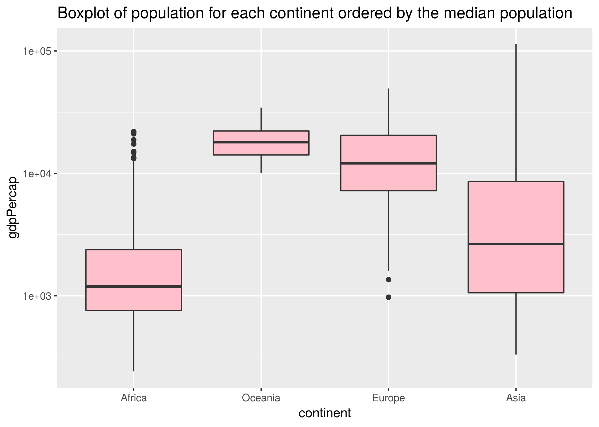
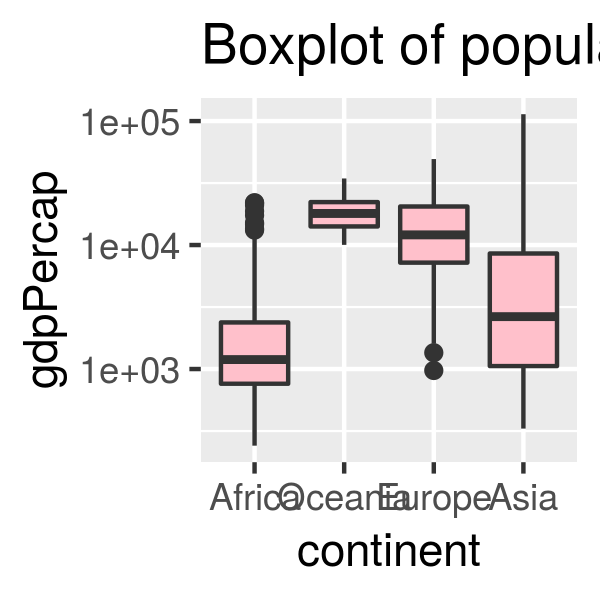
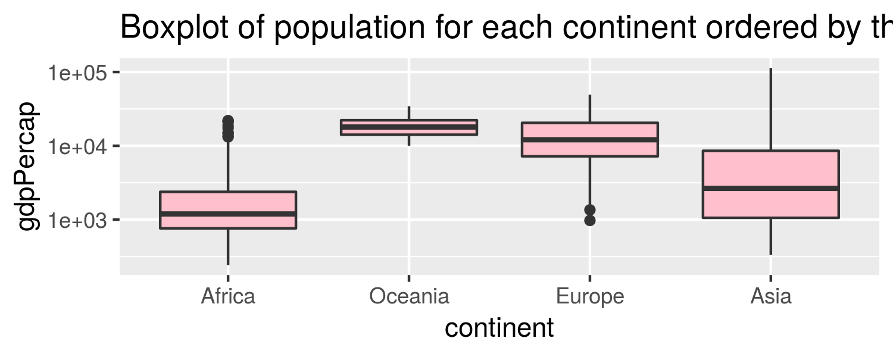

Homework 5
================
Sarafa Iyaniwura
October 12, 2018

-   [Factor and figure management](#factor-and-figure-management)
-   [Loading libraries](#loading-libraries)
-   [Part 1: Factor management](#part-1-factor-management)
    -   [Drop Oceania:](#drop-oceania)
    -   [Reorder the levels of the country or continent](#reorder-the-levels-of-the-country-or-continent)
-   [Part 2: File I/O](#part-2-file-io)
    -   [Reading and writing data set into a file](#reading-and-writing-data-set-into-a-file)
        -   [`read_csv()` and `write_csv()`](#read_csv-and-write_csv)
        -   [`read_delim()` and `write_delim()`](#read_delim-and-write_delim)
        -   [`read_delim()` and `write_delim()` separated by tab](#read_delim-and-write_delim-separated-by-tab)
        -   [`readRDS` and `saveRDS()`](#readrds-and-saverds)
        -   [`dput()` and `dget()` functions](#dput-and-dget-functions)
-   [Part 3: Visualization design](#part-3-visualization-design)
    -   [](#section)
-   [Plotly](#plotly)
-   [Part 4: Writing figures to file](#part-4-writing-figures-to-file)
-   [But I want to do more!](#but-i-want-to-do-more)

Factor and figure management
============================

Loading libraries
=================

Let us load the necessary library required for this homework.

``` r
suppressPackageStartupMessages(library(tidyverse))
```

    ## Warning: replacing previous import by 'tibble::as_tibble' when loading
    ## 'broom'

    ## Warning: replacing previous import by 'tibble::tibble' when loading 'broom'

``` r
suppressPackageStartupMessages(library(gapminder))
suppressPackageStartupMessages(library(gridExtra))
```

Part 1: Factor management
=========================

We shall be using the `gapminder` data set for this exercise.

Drop Oceania:
-------------

We begin by removing the data for the continent Oceania from the `gapminder` data set. Before we do this, let us use the `str()` function to check the number of factors in the gapminder data set and the number of level each factor has.

``` r
gapminder %>% #loads the gapminder data set and pipes it into the function in the next line
  str() 
```

    ## Classes 'tbl_df', 'tbl' and 'data.frame':    1704 obs. of  6 variables:
    ##  $ country  : Factor w/ 142 levels "Afghanistan",..: 1 1 1 1 1 1 1 1 1 1 ...
    ##  $ continent: Factor w/ 5 levels "Africa","Americas",..: 3 3 3 3 3 3 3 3 3 3 ...
    ##  $ year     : int  1952 1957 1962 1967 1972 1977 1982 1987 1992 1997 ...
    ##  $ lifeExp  : num  28.8 30.3 32 34 36.1 ...
    ##  $ pop      : int  8425333 9240934 10267083 11537966 13079460 14880372 12881816 13867957 16317921 22227415 ...
    ##  $ gdpPercap: num  779 821 853 836 740 ...

This ouput shows that the `gapminder` data set has two factors; country and continent. Country has 142 levels, while continent has 5 levels. Also we see that this data set has 1704 rows and 6 columns. We can visualized this data using a barchart as shown below;

``` r
gapminder %>%  # loads the gapminder data and pipes it into the next line
  ggplot(aes(continent)) + geom_bar() + # use ggplot to produce a barhcart
  ggtitle("The number of observations for each continent")
```


Let us arrange this data according to the population in ascending and plot a barchart of the new data set. We want to see if the `arrange()` function has an effect on the plot.

``` r
ArrGap <- gapminder %>%  # loads the gapminder data and pipes it into the next line
            arrange(pop) # arranges the data according to the population in ascending order
 
# display few rows of data
ArrGap %>%  # loads the ArrGap data and pipes it into the next line
  head() %>%
  knitr::kable()
```

| country               | continent |  year|  lifeExp|    pop|  gdpPercap|
|:----------------------|:----------|-----:|--------:|------:|----------:|
| Sao Tome and Principe | Africa    |  1952|   46.471|  60011|   879.5836|
| Sao Tome and Principe | Africa    |  1957|   48.945|  61325|   860.7369|
| Djibouti              | Africa    |  1952|   34.812|  63149|  2669.5295|
| Sao Tome and Principe | Africa    |  1962|   51.893|  65345|  1071.5511|
| Sao Tome and Principe | Africa    |  1967|   54.425|  70787|  1384.8406|
| Djibouti              | Africa    |  1957|   37.328|  71851|  2864.9691|

``` r
# plotting the data
 ArrGap %>% 
  ggplot(aes(continent)) + geom_bar() + # use ggplot to produce a barhcart 
  ggtitle("The number of observations for each continent")
```


Observe from the table and figures above that the `arrange()` function re-arranges the rows of the data but this re-arrangement does not affect the figure produced by the arranged data.

Now, let us extract out data from gapminder.

``` r
# create a subset of gapminder data that does not contain Oceania, call this data set 'GapNoOcean'
GapNoOcean <- gapminder %>% #loads the data set and pipes it into the function in the next line
        filter(continent != "Oceania")
# displaying table nicely
head(GapNoOcean,15) %>%
  knitr::kable()
```

| country     | continent |  year|  lifeExp|       pop|  gdpPercap|
|:------------|:----------|-----:|--------:|---------:|----------:|
| Afghanistan | Asia      |  1952|   28.801|   8425333|   779.4453|
| Afghanistan | Asia      |  1957|   30.332|   9240934|   820.8530|
| Afghanistan | Asia      |  1962|   31.997|  10267083|   853.1007|
| Afghanistan | Asia      |  1967|   34.020|  11537966|   836.1971|
| Afghanistan | Asia      |  1972|   36.088|  13079460|   739.9811|
| Afghanistan | Asia      |  1977|   38.438|  14880372|   786.1134|
| Afghanistan | Asia      |  1982|   39.854|  12881816|   978.0114|
| Afghanistan | Asia      |  1987|   40.822|  13867957|   852.3959|
| Afghanistan | Asia      |  1992|   41.674|  16317921|   649.3414|
| Afghanistan | Asia      |  1997|   41.763|  22227415|   635.3414|
| Afghanistan | Asia      |  2002|   42.129|  25268405|   726.7341|
| Afghanistan | Asia      |  2007|   43.828|  31889923|   974.5803|
| Albania     | Europe    |  1952|   55.230|   1282697|  1601.0561|
| Albania     | Europe    |  1957|   59.280|   1476505|  1942.2842|
| Albania     | Europe    |  1962|   64.820|   1728137|  2312.8890|

Let us use the `str()` function to to check the factors and their levels of our new data set.

``` r
GapNoOcean %>% #loads the data set and pipes it into the function in the next line
  str() 
```

    ## Classes 'tbl_df', 'tbl' and 'data.frame':    1680 obs. of  6 variables:
    ##  $ country  : Factor w/ 142 levels "Afghanistan",..: 1 1 1 1 1 1 1 1 1 1 ...
    ##  $ continent: Factor w/ 5 levels "Africa","Americas",..: 3 3 3 3 3 3 3 3 3 3 ...
    ##  $ year     : int  1952 1957 1962 1967 1972 1977 1982 1987 1992 1997 ...
    ##  $ lifeExp  : num  28.8 30.3 32 34 36.1 ...
    ##  $ pop      : int  8425333 9240934 10267083 11537966 13079460 14880372 12881816 13867957 16317921 22227415 ...
    ##  $ gdpPercap: num  779 821 853 836 740 ...

After removing the rows for the countries in Oceania from the gapminder data set, the new data set has 1680 rows, although, the number of factors in the new data set still remains 5. Let us check the levels in the continent factor again using the `level()` function.

``` r
levels(GapNoOcean$continent)  # displays the number of levelsof the continent factor
```

    ## [1] "Africa"   "Americas" "Asia"     "Europe"   "Oceania"

This also shows that there are 5 level, this shows both the used and unused levels.

``` r
GapNoOcean %>% #loads the data set and pipes it into the function in the next line
  ggplot(aes(continent)) + geom_bar() +  # plots a barchart of the data
  scale_x_discrete(drop=FALSE) + ggtitle("The number of observations for each continent")
```


This plot shows that the continent Oceania is still a level in the data, althogh it has no entries. Let us arrange this new data set according to the population size in ascending order.

``` r
GapNoOcean %>%  #loads the data set and pipes it into the function in the next line
  arrange(pop) %>%  # arranges the data according to the population size in ascending order
  ggplot(aes(continent)) + geom_bar()  + # plots barchart
  ggtitle("The number of observations for each continent")
```


After arranging re-arranging the data, the Oceania continent is dropped from the barchart.

Let us remove unused levels in the continent.

``` r
GapNoOceanD <- GapNoOcean %>%
                droplevels() # drops the unused levels

str(GapNoOceanD) # displays the structure of the data
```

    ## Classes 'tbl_df', 'tbl' and 'data.frame':    1680 obs. of  6 variables:
    ##  $ country  : Factor w/ 140 levels "Afghanistan",..: 1 1 1 1 1 1 1 1 1 1 ...
    ##  $ continent: Factor w/ 4 levels "Africa","Americas",..: 3 3 3 3 3 3 3 3 3 3 ...
    ##  $ year     : int  1952 1957 1962 1967 1972 1977 1982 1987 1992 1997 ...
    ##  $ lifeExp  : num  28.8 30.3 32 34 36.1 ...
    ##  $ pop      : int  8425333 9240934 10267083 11537966 13079460 14880372 12881816 13867957 16317921 22227415 ...
    ##  $ gdpPercap: num  779 821 853 836 740 ...

``` r
levels(GapNoOceanD$continent) # shows the levels in the continent factor
```

    ## [1] "Africa"   "Americas" "Asia"     "Europe"

It now shows that the continent factor has only 4 levels.

There are other ways we can drop unused levels, let us check them out!

``` r
forcats::fct_drop(GapNoOcean$continent) %>% # drops unused levels
  levels() # shows the levels in the continent factor
```

    ## [1] "Africa"   "Americas" "Asia"     "Europe"

``` r
fct_drop(GapNoOcean$continent) %>%  # drops unused levels
  levels()  # shows the levels in the continent factor
```

    ## [1] "Africa"   "Americas" "Asia"     "Europe"

Reorder the levels of the country or continent
----------------------------------------------

Let us start by plotting a barchart of the `GapNoOceanD` data.

``` r
GapNoOceanD %>%  # loads the data set and pipes it into the next line
  ggplot(aes(continent)) + geom_bar() +  # plots the barchart
  scale_x_discrete(drop=FALSE)  + ggtitle("The number of observations for each continent")
```


The continent factor can be reordered in descending order of the freqency of the barchart;

``` r
GapNoOceanD$continent %>% # loads the data set and pipes it into the next line
  fct_infreq() %>% # reorders level in descending order of frequency
   qplot()  + ggtitle("The number of observations for each continent in descending order") # plots barchart
```


This ordering is reversed using the `forcats::fct_rev()` function.

``` r
GapNoOceanD$continent %>% # loads the data set and pipes it into the next line
  forcats::fct_infreq() %>%  # reorders level in descending order of frequency
  forcats::fct_rev() %>%  # reverses the previous order
   qplot()  + ggtitle("The number of observations for each continent after reversing level")
```


Let us present a boxplot of the reordering of continents based on some principled summary of `pop`.

``` r
GapNoOceanD %>%
  ggplot( aes(continent,pop)) +   geom_boxplot() +
  scale_y_log10()  + ggtitle("Boxplot of population for each continent ordered by the median population")
```


``` r
GapNoOceanD %>% #%  
  group_by(continent) %>%
  mutate(median = median((pop))) %>%
  arrange(median) %>%
  ggplot( aes(continent,pop)) +   geom_boxplot(fill='pink') +
  scale_y_log10()  + ggtitle("Boxplot of population for each continent ordered by the median population")
```


``` r
GapNoOceanD %>%
  mutate(continent= fct_reorder(continent,pop)) %>%
  ggplot( aes(continent,pop)) +   geom_boxplot(fill='pink') +
  scale_y_log10()  + ggtitle("Boxplot of population for each continent ordered by the median population")
```


``` r
GapNoOceanD %>% #%  group_by(continent) %>%
  group_by(continent) %>%
  mutate(median = median((pop))) %>%
  arrange(median) 
```

    ## # A tibble: 1,680 x 7
    ## # Groups:   continent [4]
    ##    country continent  year lifeExp      pop gdpPercap  median
    ##    <fct>   <fct>     <int>   <dbl>    <int>     <dbl>   <dbl>
    ##  1 Algeria Africa     1952    43.1  9279525     2449. 4579311
    ##  2 Algeria Africa     1957    45.7 10270856     3014. 4579311
    ##  3 Algeria Africa     1962    48.3 11000948     2551. 4579311
    ##  4 Algeria Africa     1967    51.4 12760499     3247. 4579311
    ##  5 Algeria Africa     1972    54.5 14760787     4183. 4579311
    ##  6 Algeria Africa     1977    58.0 17152804     4910. 4579311
    ##  7 Algeria Africa     1982    61.4 20033753     5745. 4579311
    ##  8 Algeria Africa     1987    65.8 23254956     5681. 4579311
    ##  9 Algeria Africa     1992    67.7 26298373     5023. 4579311
    ## 10 Algeria Africa     1997    69.2 29072015     4797. 4579311
    ## # ... with 1,670 more rows

``` r
GapNoOceanD %>%
  group_by(continent) %>%
  summarise()
```

    ## # A tibble: 4 x 1
    ##   continent
    ##   <fct>    
    ## 1 Africa   
    ## 2 Americas 
    ## 3 Asia     
    ## 4 Europe

``` r
GapNoOceanD %>%
  mutate(continent= fct_reorder(continent,pop,median)) %>%
  group_by(continent) %>%
  summarise()
```

    ## # A tibble: 4 x 1
    ##   continent
    ##   <fct>    
    ## 1 Africa   
    ## 2 Americas 
    ## 3 Europe   
    ## 4 Asia

-   Reorder by median population of each continent

``` r
GapNoOceanD %>% # loads data and pipes it to the next line
  mutate(continent= fct_reorder(continent,pop)) %>%   # reorders the data
  ggplot( aes(continent,pop)) +   geom_boxplot() + # plots a boxplot
  scale_y_log10()  + ggtitle("Population of each continent reordered by median population")
```


-   Reorder by mean population of each continent

``` r
GapNoOceanD %>% # loads data and pipes it to the next line
  mutate(continent= fct_reorder(continent,pop, mean)) %>%  # reorders the data
  ggplot( aes(continent, pop)) +   geom_boxplot() +  # plots a boxplot
  scale_y_log10()  + ggtitle("Population of each continent reordered by mean population")
```


-   Reorder by maximum population of each continent

``` r
GapNoOceanD %>% # loads data and pipes it to the next line
  mutate(continent= fct_reorder(continent,pop, max)) %>%  # reorders the data
  ggplot( aes(continent, pop)) +   geom_boxplot() +  # plots a boxplot
  scale_y_log10()  + ggtitle("Population of each continent reordered by maximum population")
```


-   Reorder by minimum population of each continent

``` r
GapNoOceanD %>% # loads data and pipes it to the next line
  mutate(continent= fct_reorder(continent,pop, min )) %>%   # reorders the data
  ggplot( aes(continent,pop)) +   geom_boxplot() +  # plots a boxplot
  scale_y_log10() + ggtitle("Population of each continent reordered by minimum population")
```


Part 2: File I/O
================

Reading and writing data set into a file
----------------------------------------

First, let us extract the data set to be used for this exercise from the `gapminder` data set.

``` r
NewGap <- gapminder %>%  # loads data and pipes it to the next line
            filter(continent == "Europe"|continent == "Asia"|continent == "Africa"|continent == "Oceania") %>%
            arrange(gdpPercap) 

str(NewGap) # displays structure of new data set
```

    ## Classes 'tbl_df', 'tbl' and 'data.frame':    1404 obs. of  6 variables:
    ##  $ country  : Factor w/ 142 levels "Afghanistan",..: 28 28 74 53 28 42 88 74 18 42 ...
    ##  $ continent: Factor w/ 5 levels "Africa","Americas",..: 1 1 1 1 1 1 3 1 1 1 ...
    ##  $ year     : int  2002 2007 1952 1952 1997 1952 1952 1957 1952 1957 ...
    ##  $ lifeExp  : num  45 46.5 42.1 32.5 42.6 ...
    ##  $ pop      : int  55379852 64606759 748747 580653 47798986 1438760 20092996 813338 2445618 1542611 ...
    ##  $ gdpPercap: num  241 278 299 300 312 ...

``` r
# display few rows of new data set
NewGap %>% # loads data and pipes it to the next line
    head() %>%
    knitr::kable()
```

| country          | continent |  year|  lifeExp|       pop|  gdpPercap|
|:-----------------|:----------|-----:|--------:|---------:|----------:|
| Congo, Dem. Rep. | Africa    |  2002|   44.966|  55379852|   241.1659|
| Congo, Dem. Rep. | Africa    |  2007|   46.462|  64606759|   277.5519|
| Lesotho          | Africa    |  1952|   42.138|    748747|   298.8462|
| Guinea-Bissau    | Africa    |  1952|   32.500|    580653|   299.8503|
| Congo, Dem. Rep. | Africa    |  1997|   42.587|  47798986|   312.1884|
| Eritrea          | Africa    |  1952|   35.928|   1438760|   328.9406|

Let us create a boxplot of the extracted data and name it `Default`.

``` r
Default <-NewGap %>% # loads data and pipes it to the next line
            ggplot( aes(continent,gdpPercap)) +   geom_boxplot(fill='green') + # plots a boxplot
            scale_y_log10()  + ggtitle("Without factor re-order") # scales the y-axis and put title on the graph

Default
```


Now, we reorder the factor levels and create another boxplot.

``` r
NewGapReorder <-NewGap %>%  # loads data and pipes it to the next line
  mutate(continent= fct_reorder(continent,gdpPercap,max))   # reorders the level of the continent using the max population

P <- NewGapReorder %>%  # loads data and pipes it to the next line
  ggplot( aes(continent,gdpPercap)) +   geom_boxplot(fill='pink') + # produces a boxplot
  scale_y_log10()  + ggtitle("Re-ordering factor by max. GdpPercap")

grid.arrange(Default,P,ncol=2,top="Comparing the Boxplot of GdpPerCap for the continents with and without factor re-order")
```


We display the ordering of the levels of continent.

``` r
levels(NewGapReorder$continent)  # displays the levels of the selected factor the way the are ordered
```

    ## [1] "Africa"   "Oceania"  "Europe"   "Asia"     "Americas"

Let us create another plot of the reorder data and assign it to the variable `PP`. This plot will be places side-by-side to the new plot generated from the data read from files in order to determine which of the writing and reading format preserves ordering.

``` r
PP <-NewGapReorder %>%  # loads data and pipes it to the next line
  mutate(continent= fct_reorder(continent,gdpPercap,max)) %>%  # reorder continent by max population
  ggplot( aes(continent,gdpPercap)) +   geom_boxplot(fill='pink') +  # produces boxplot
  scale_y_log10()  + ggtitle("Data written to file")
```

### `read_csv()` and `write_csv()`

Writing the reordered data to file.

``` r
write_csv(NewGapReorder,"NewGap") # writes the gapminder data set into a file called 'MyGapMinder', in .csv format
```

Reading back from file.

``` r
# reading data from file
GapCSV <- read_csv("NewGap")  # reads the gapminder file in csv format
```

    ## Parsed with column specification:
    ## cols(
    ##   country = col_character(),
    ##   continent = col_character(),
    ##   year = col_integer(),
    ##   lifeExp = col_double(),
    ##   pop = col_integer(),
    ##   gdpPercap = col_double()
    ## )

``` r
# displays the structure
GapCSV %>%
  str()
```

    ## Classes 'tbl_df', 'tbl' and 'data.frame':    1404 obs. of  6 variables:
    ##  $ country  : chr  "Congo, Dem. Rep." "Congo, Dem. Rep." "Lesotho" "Guinea-Bissau" ...
    ##  $ continent: chr  "Africa" "Africa" "Africa" "Africa" ...
    ##  $ year     : int  2002 2007 1952 1952 1997 1952 1952 1957 1952 1957 ...
    ##  $ lifeExp  : num  45 46.5 42.1 32.5 42.6 ...
    ##  $ pop      : int  55379852 64606759 748747 580653 47798986 1438760 20092996 813338 2445618 1542611 ...
    ##  $ gdpPercap: num  241 278 299 300 312 ...
    ##  - attr(*, "spec")=List of 2
    ##   ..$ cols   :List of 6
    ##   .. ..$ country  : list()
    ##   .. .. ..- attr(*, "class")= chr  "collector_character" "collector"
    ##   .. ..$ continent: list()
    ##   .. .. ..- attr(*, "class")= chr  "collector_character" "collector"
    ##   .. ..$ year     : list()
    ##   .. .. ..- attr(*, "class")= chr  "collector_integer" "collector"
    ##   .. ..$ lifeExp  : list()
    ##   .. .. ..- attr(*, "class")= chr  "collector_double" "collector"
    ##   .. ..$ pop      : list()
    ##   .. .. ..- attr(*, "class")= chr  "collector_integer" "collector"
    ##   .. ..$ gdpPercap: list()
    ##   .. .. ..- attr(*, "class")= chr  "collector_double" "collector"
    ##   ..$ default: list()
    ##   .. ..- attr(*, "class")= chr  "collector_guess" "collector"
    ##   ..- attr(*, "class")= chr "col_spec"

``` r
# display in table
GapCSV %>%
  head() %>%
  knitr::kable()
```

| country          | continent |  year|  lifeExp|       pop|  gdpPercap|
|:-----------------|:----------|-----:|--------:|---------:|----------:|
| Congo, Dem. Rep. | Africa    |  2002|   44.966|  55379852|   241.1659|
| Congo, Dem. Rep. | Africa    |  2007|   46.462|  64606759|   277.5519|
| Lesotho          | Africa    |  1952|   42.138|    748747|   298.8462|
| Guinea-Bissau    | Africa    |  1952|   32.500|    580653|   299.8503|
| Congo, Dem. Rep. | Africa    |  1997|   42.587|  47798986|   312.1884|
| Eritrea          | Africa    |  1952|   35.928|   1438760|   328.9406|

Observe that the structure is not the same as the data written to file, the factors continent and country are now character, although the table is still the same.

``` r
P2 <- GapCSV %>%
  ggplot( aes(continent,gdpPercap)) +  geom_boxplot() +
  scale_y_log10() + ggtitle("Data read from file")

grid.arrange(PP,P2,ncol=2,top="Comparing the boxplots otained from data written to file and the one from data read from file")
```


### `read_delim()` and `write_delim()`

Writing to file:

``` r
write_delim(NewGapReorder,"NewGap.txt",delim = "$")  # writes the data to file
```

Reading from file:

``` r
GapTxt <- read_delim("NewGap.txt", delim="$")  # reads data from file
```

    ## Parsed with column specification:
    ## cols(
    ##   country = col_character(),
    ##   continent = col_character(),
    ##   year = col_integer(),
    ##   lifeExp = col_double(),
    ##   pop = col_integer(),
    ##   gdpPercap = col_double()
    ## )

``` r
str(GapTxt) # display the structure of the data
```

    ## Classes 'tbl_df', 'tbl' and 'data.frame':    1404 obs. of  6 variables:
    ##  $ country  : chr  "Congo, Dem. Rep." "Congo, Dem. Rep." "Lesotho" "Guinea-Bissau" ...
    ##  $ continent: chr  "Africa" "Africa" "Africa" "Africa" ...
    ##  $ year     : int  2002 2007 1952 1952 1997 1952 1952 1957 1952 1957 ...
    ##  $ lifeExp  : num  45 46.5 42.1 32.5 42.6 ...
    ##  $ pop      : int  55379852 64606759 748747 580653 47798986 1438760 20092996 813338 2445618 1542611 ...
    ##  $ gdpPercap: num  241 278 299 300 312 ...
    ##  - attr(*, "spec")=List of 2
    ##   ..$ cols   :List of 6
    ##   .. ..$ country  : list()
    ##   .. .. ..- attr(*, "class")= chr  "collector_character" "collector"
    ##   .. ..$ continent: list()
    ##   .. .. ..- attr(*, "class")= chr  "collector_character" "collector"
    ##   .. ..$ year     : list()
    ##   .. .. ..- attr(*, "class")= chr  "collector_integer" "collector"
    ##   .. ..$ lifeExp  : list()
    ##   .. .. ..- attr(*, "class")= chr  "collector_double" "collector"
    ##   .. ..$ pop      : list()
    ##   .. .. ..- attr(*, "class")= chr  "collector_integer" "collector"
    ##   .. ..$ gdpPercap: list()
    ##   .. .. ..- attr(*, "class")= chr  "collector_double" "collector"
    ##   ..$ default: list()
    ##   .. ..- attr(*, "class")= chr  "collector_guess" "collector"
    ##   ..- attr(*, "class")= chr "col_spec"

``` r
# display few row in table
GapTxt %>%
  head() %>%
  knitr::kable()
```

| country          | continent |  year|  lifeExp|       pop|  gdpPercap|
|:-----------------|:----------|-----:|--------:|---------:|----------:|
| Congo, Dem. Rep. | Africa    |  2002|   44.966|  55379852|   241.1659|
| Congo, Dem. Rep. | Africa    |  2007|   46.462|  64606759|   277.5519|
| Lesotho          | Africa    |  1952|   42.138|    748747|   298.8462|
| Guinea-Bissau    | Africa    |  1952|   32.500|    580653|   299.8503|
| Congo, Dem. Rep. | Africa    |  1997|   42.587|  47798986|   312.1884|
| Eritrea          | Africa    |  1952|   35.928|   1438760|   328.9406|

Similar to .csv format, the structure of the data read from file is not the same as the data written to file, the factors continent and country are now character, although the table is still the same. We can also verify this from the plots.

``` r
P3 <- GapTxt %>%
 ggplot( aes(continent,gdpPercap)) +  geom_boxplot() +
  scale_y_log10() + ggtitle("Data read from file")

grid.arrange(PP,P3,ncol=2,top="Comparing the boxplots otained from data written to file and the one from data read from file")
```


In addition, we can write data into a file in such a way that each of the columns are separated by tab. This is the TSV format, meaning tab separated format

### `read_delim()` and `write_delim()` separated by tab

Writing data to file:

``` r
write_delim(NewGapReorder,"NewGap.tsv",delim = "\t")  # writes the data to file
```

Reading data from file:

``` r
GapTab <- read_delim("NewGap.tsv", delim="\t")  # reads the gapminder file in csv format
```

    ## Parsed with column specification:
    ## cols(
    ##   country = col_character(),
    ##   continent = col_character(),
    ##   year = col_integer(),
    ##   lifeExp = col_double(),
    ##   pop = col_integer(),
    ##   gdpPercap = col_double()
    ## )

``` r
str(GapTab) # display structure of data
```

    ## Classes 'tbl_df', 'tbl' and 'data.frame':    1404 obs. of  6 variables:
    ##  $ country  : chr  "Congo, Dem. Rep." "Congo, Dem. Rep." "Lesotho" "Guinea-Bissau" ...
    ##  $ continent: chr  "Africa" "Africa" "Africa" "Africa" ...
    ##  $ year     : int  2002 2007 1952 1952 1997 1952 1952 1957 1952 1957 ...
    ##  $ lifeExp  : num  45 46.5 42.1 32.5 42.6 ...
    ##  $ pop      : int  55379852 64606759 748747 580653 47798986 1438760 20092996 813338 2445618 1542611 ...
    ##  $ gdpPercap: num  241 278 299 300 312 ...
    ##  - attr(*, "spec")=List of 2
    ##   ..$ cols   :List of 6
    ##   .. ..$ country  : list()
    ##   .. .. ..- attr(*, "class")= chr  "collector_character" "collector"
    ##   .. ..$ continent: list()
    ##   .. .. ..- attr(*, "class")= chr  "collector_character" "collector"
    ##   .. ..$ year     : list()
    ##   .. .. ..- attr(*, "class")= chr  "collector_integer" "collector"
    ##   .. ..$ lifeExp  : list()
    ##   .. .. ..- attr(*, "class")= chr  "collector_double" "collector"
    ##   .. ..$ pop      : list()
    ##   .. .. ..- attr(*, "class")= chr  "collector_integer" "collector"
    ##   .. ..$ gdpPercap: list()
    ##   .. .. ..- attr(*, "class")= chr  "collector_double" "collector"
    ##   ..$ default: list()
    ##   .. ..- attr(*, "class")= chr  "collector_guess" "collector"
    ##   ..- attr(*, "class")= chr "col_spec"

``` r
# display few rows of data in table
GapTab %>%
  head() %>%
  knitr::kable()
```

| country          | continent |  year|  lifeExp|       pop|  gdpPercap|
|:-----------------|:----------|-----:|--------:|---------:|----------:|
| Congo, Dem. Rep. | Africa    |  2002|   44.966|  55379852|   241.1659|
| Congo, Dem. Rep. | Africa    |  2007|   46.462|  64606759|   277.5519|
| Lesotho          | Africa    |  1952|   42.138|    748747|   298.8462|
| Guinea-Bissau    | Africa    |  1952|   32.500|    580653|   299.8503|
| Congo, Dem. Rep. | Africa    |  1997|   42.587|  47798986|   312.1884|
| Eritrea          | Africa    |  1952|   35.928|   1438760|   328.9406|

Here also, the structure of the data read from file is not the same as the data written to file, the factors continent and country are now character, although the table is still the same. Let display a boxplot of the data side-by-side.

``` r
P4 <- GapTab %>%
 ggplot( aes(continent,gdpPercap)) +  geom_boxplot() +
  scale_y_log10() + ggtitle("Data read from file")

grid.arrange(PP,P4,ncol=2,top="Comparing the boxplots otained from data written to file and the one from data read from file")
```


### `readRDS` and `saveRDS()`

Writing to file:

``` r
saveRDS(NewGapReorder,"NewGap.rds")  # writes the data set in compressed format (.rds format)
```

This functions writes data to file in a compressed format.

``` r
GapRDS <- readRDS("NewGap.rds")  # reads from file

str(GapRDS) # display the structure
```

    ## Classes 'tbl_df', 'tbl' and 'data.frame':    1404 obs. of  6 variables:
    ##  $ country  : Factor w/ 142 levels "Afghanistan",..: 28 28 74 53 28 42 88 74 18 42 ...
    ##  $ continent: Factor w/ 5 levels "Africa","Oceania",..: 1 1 1 1 1 1 4 1 1 1 ...
    ##  $ year     : int  2002 2007 1952 1952 1997 1952 1952 1957 1952 1957 ...
    ##  $ lifeExp  : num  45 46.5 42.1 32.5 42.6 ...
    ##  $ pop      : int  55379852 64606759 748747 580653 47798986 1438760 20092996 813338 2445618 1542611 ...
    ##  $ gdpPercap: num  241 278 299 300 312 ...

``` r
# display few rows of data in table
GapRDS %>%
  head() %>%
  knitr::kable()
```

| country          | continent |  year|  lifeExp|       pop|  gdpPercap|
|:-----------------|:----------|-----:|--------:|---------:|----------:|
| Congo, Dem. Rep. | Africa    |  2002|   44.966|  55379852|   241.1659|
| Congo, Dem. Rep. | Africa    |  2007|   46.462|  64606759|   277.5519|
| Lesotho          | Africa    |  1952|   42.138|    748747|   298.8462|
| Guinea-Bissau    | Africa    |  1952|   32.500|    580653|   299.8503|
| Congo, Dem. Rep. | Africa    |  1997|   42.587|  47798986|   312.1884|
| Eritrea          | Africa    |  1952|   35.928|   1438760|   328.9406|

Unlike, the previous format we have seen, this format preserves the structure of the data when reading from file. Let us confirm that the level are still in the same order as it was written to the file.

``` r
levels(GapRDS$continent) # displays the levels of the selected factor in proper order
```

    ## [1] "Africa"   "Oceania"  "Europe"   "Asia"     "Americas"

Observe that the ordering is also preserved. Yay! Let us check the boxplots:

``` r
P5 <- GapRDS %>%
 ggplot( aes(continent,gdpPercap)) +  geom_boxplot() +
  scale_y_log10() + ggtitle("Data read from file")


grid.arrange(PP,P5,ncol=2,top="Comparing the boxplots otained from data written to file and the one from data read from file")
```


The ordering is also preserved in the figures.

### `dput()` and `dget()` functions

Writing to file:

``` r
dput(NewGapReorder,"MyGapMinderDput.txt")  # writes data to file
```

Reading from file:

``` r
GapDput <- dget("MyGapMinderDput.txt")  # reads data from file

str(GapDput) # displays structure
```

    ## Classes 'tbl_df', 'tbl' and 'data.frame':    1404 obs. of  6 variables:
    ##  $ country  : Factor w/ 142 levels "Afghanistan",..: 28 28 74 53 28 42 88 74 18 42 ...
    ##  $ continent: Factor w/ 5 levels "Africa","Oceania",..: 1 1 1 1 1 1 4 1 1 1 ...
    ##  $ year     : int  2002 2007 1952 1952 1997 1952 1952 1957 1952 1957 ...
    ##  $ lifeExp  : num  45 46.5 42.1 32.5 42.6 ...
    ##  $ pop      : int  55379852 64606759 748747 580653 47798986 1438760 20092996 813338 2445618 1542611 ...
    ##  $ gdpPercap: num  241 278 299 300 312 ...

``` r
# display few rows in table
GapDput %>%
  head() %>%
  knitr::kable()
```

| country          | continent |  year|  lifeExp|       pop|  gdpPercap|
|:-----------------|:----------|-----:|--------:|---------:|----------:|
| Congo, Dem. Rep. | Africa    |  2002|   44.966|  55379852|   241.1659|
| Congo, Dem. Rep. | Africa    |  2007|   46.462|  64606759|   277.5519|
| Lesotho          | Africa    |  1952|   42.138|    748747|   298.8462|
| Guinea-Bissau    | Africa    |  1952|   32.500|    580653|   299.8503|
| Congo, Dem. Rep. | Africa    |  1997|   42.587|  47798986|   312.1884|
| Eritrea          | Africa    |  1952|   35.928|   1438760|   328.9406|

The structure of the data is also preserved with this format. How about we plot a boxplot of the data read from file and compare with the boxplot of the data written to file?

``` r
P6 <- GapDput %>%
 ggplot( aes(continent,gdpPercap)) +  geom_boxplot() +
  scale_y_log10() + ggtitle("Data read from file")

grid.arrange(PP,P6,ncol=2,top="Comparing the boxplots otained from data written to file and the one from data read from file")
```


These figures are identical, which confirms that the structure of the data is preserved.

Part 3: Visualization design
============================

We begin by loading the necessary libraries required for this exercise.

``` r
suppressPackageStartupMessages(library(scales))
suppressPackageStartupMessages(library(plotly))
```

``` r
FirstAttempt <- gapminder %>%
            ggplot(aes(pop,lifeExp)) + geom_point(aes(color=gdpPercap), alpha = 0.3) 

Attempt1 <- FirstAttempt  +  scale_x_log10() + ggtitle("Attempt 1")
Attempt1 
```


``` r
Attempt2 <-  FirstAttempt +  # loads the previous plot
            scale_color_continuous(trans="log10",       # makes the colorign continuous
                                   breaks = 5^(1:10),             # labels the legend in multiples of 5
                                   labels = comma_format()        # wtites the legend label in comma separated format
                                    ) + 
            scale_y_continuous(breaks = 10*(1:10)) + # labels the y-axis in multiples of 10
            scale_x_continuous(trans = "log10",   # puts the x-axis in log10 scale
                               labels = comma_format(),  # put the x-label in comma format
                               ) + ggtitle("Attempt 2: scale_color_continuous")
Attempt2  
```


``` r
Attempt3 <-  FirstAttempt +  # loads the previous plot
            scale_color_distiller(trans="log10",       # makes the colorign continuous
                                   breaks = 5^(1:10),             # labels the legend in multiples of 5
                                   labels = comma_format(),        # wtites the legend label in comma separated format
                                    palette = "Reds") + 
            scale_y_continuous(breaks = 10*(1:10)) + # labels the y-axis in multiples of 10
            scale_x_continuous(trans = "log10",   # puts the x-axis in log10 scale
                               labels = comma_format(),  # put the x-label in comma format
                               )  + ggtitle("Attempt 3: scale_color_distiller")
                  
Attempt3 
```


``` r
Attempt4 <-  FirstAttempt +  # loads the previous plot
            scale_color_viridis_c(trans="log10",       # makes the colorign continuous
                                   breaks = 5^(1:10),             # labels the legend in multiples of 5
                                   labels = comma_format()        # wtites the legend label in comma separated format
                                   ) + 
            scale_y_continuous(breaks = 10*(1:10)) + # labels the y-axis in multiples of 10
            scale_x_continuous(trans = "log10",   # puts the x-axis in log10 scale
                               labels = comma_format(),  # put the x-label in comma format
                               )   + ggtitle("Attempt 2: scale_color_viridis_c")
                  
Attempt4 
```


Putting all the attmept together,

``` r
 grid.arrange(Attempt1,Attempt2,Attempt3,Attempt4,ncol=2,top="Different Attempts")
```


``` r
#ggplotly(Attempt1)
```

``` r
#ggplotly(Attempt2)
```

############################################### 

``` r
lifeExp_vs_Gdp <- gapminder %>%
    ggplot(aes(gdpPercap, lifeExp)) + geom_point(aes(color=continent)) + 
    scale_x_log10() + 
    facet_wrap(~continent) +
    ggtitle( "Life Expectancy vs Gdp per capital for different continents")

lifeExp_vs_Gdp
```


Then, change font size of axis labels, and the strip background colour. Others?

``` r
lifeExp_vs_Gdp +
    theme_bw() +
    theme(axis.text = element_text(size=16),
          strip.text = element_text(size=16,color = "blue"),
          strip.background = element_rect(fill = "orange"),
          panel.background = element_rect(fill = "pink"))
```


Plotly
======

Consider the following plot:

``` r
(p <- gapminder %>% 
     filter(continent != "Oceania") %>% 
     ggplot(aes(gdpPercap, lifeExp)) +
     geom_point(aes(colour=pop), alpha=0.2) +
     scale_x_log10(labels=dollar_format()) +
     scale_colour_distiller(
         trans   = "log10",
         breaks  = 10^(1:10),
         labels  = comma_format(),
         palette = "Greens"
     ) +
     facet_wrap(~ continent) +
     scale_y_continuous(breaks=10*(1:10)) +
     theme_bw())
```


Part 4: Writing figures to file
===============================

``` r
NewGap_Boxplot <-NewGap %>%
  mutate(continent= fct_reorder(continent,gdpPercap,max)) %>%
  arrange(gdpPercap) %>%
  ggplot( aes(continent,gdpPercap)) +   geom_boxplot(fill='pink') +
  scale_y_log10()  + ggtitle("Boxplot of population for each continent ordered by the median population")


ggsave("Boxplot.png", NewGap_Boxplot)
```

    ## Saving 7 x 5 in image



``` r
ggsave("Boxplot2.png", plot = NewGap_Boxplot, width = 2, height = 2)
```



``` r
ggsave("Boxplot3.png", plot = NewGap_Boxplot, width = 5, height = 2, limitsize =TRUE, dpi = 300) 
```



``` r
ggsave("Boxplot4.pdf", plot = NewGap_Boxplot, width = 5, height = 2, limitsize =TRUE, dpi = 300) 
```


But I want to do more!
======================

-   Gapminder version

Let us extract the rows for some countries in the gapminder data:

``` r
Sport_Gap <- gapminder %>%
    filter(year == "1952") %>%
    filter(country %in% c("Nigeria", "Canada", "India", "Sweden", "Brazil")) %>%
    mutate(Sports = c("Soccer","Ice hockey","Cricket","Biking","Soccer"))
```

``` r
factor(Sport_Gap$Sports)
```

    ## [1] Soccer     Ice hockey Cricket    Biking     Soccer    
    ## Levels: Biking Cricket Ice hockey Soccer

``` r
Sport_Gap %>%
  str
```

    ## Classes 'tbl_df', 'tbl' and 'data.frame':    5 obs. of  7 variables:
    ##  $ country  : Factor w/ 142 levels "Afghanistan",..: 15 21 59 95 123
    ##  $ continent: Factor w/ 5 levels "Africa","Americas",..: 2 2 3 1 4
    ##  $ year     : int  1952 1952 1952 1952 1952
    ##  $ lifeExp  : num  50.9 68.8 37.4 36.3 71.9
    ##  $ pop      : int  56602560 14785584 372000000 33119096 7124673
    ##  $ gdpPercap: num  2109 11367 547 1077 8528
    ##  $ Sports   : chr  "Soccer" "Ice hockey" "Cricket" "Biking" ...
